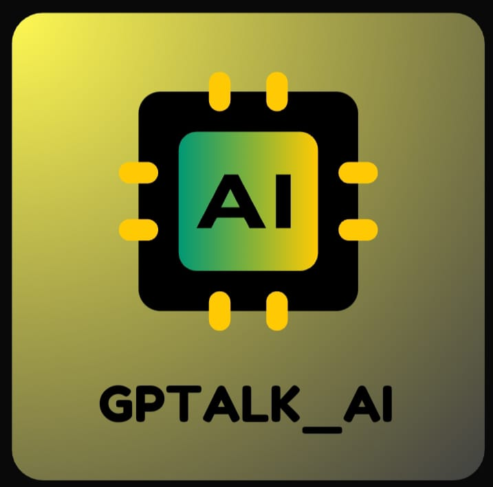

# GPTALK_AI - Mobile Chatbot with Voice Assistant



**GPTALK_AI** is a mobile application chatbot built in Android Studio using the OpenAI API and Brainshop API. This project was developed for the hackathon conducted by MultiversX and Encode Club. The application combines the power of advanced natural language processing (NLP) with voice assistant capabilities to provide an interactive and engaging user experience.

## Table of Contents

- [Features](#features)
- [Getting Started](#getting-started)
  - [Prerequisites](#prerequisites)
  - [Installation](#installation)
- [Usage](#usage)
- [API Integration](#api-integration)
- [Contributing](#contributing)
- [License](#license)

## Features

- **Natural Language Processing**: GPTALK_AI leverages the OpenAI API to understand and respond to user inputs in a conversational manner.

- **Voice Assistant**: The application includes a voice assistant that can provide information and perform tasks using speech recognition and synthesis.

- **Multimodal Interaction**: Users can interact with the chatbot via both text input and voice commands.

- **Hackathon Ready**: GPTALK_AI was specifically developed for the hackathon conducted by MultiversX and Encode Club, making it a great starting point for hackathon participants.

## Getting Started

Follow these instructions to get a copy of the project up and running on your local machine.

### Prerequisites

To build and run this application, you need the following tools and libraries:

- [Android Studio](https://developer.android.com/studio) installed on your development machine.
- An OpenAI API key (You can obtain it by signing up for the OpenAI API).
- A Brainshop API key (You can obtain it by signing up for Brainshop).

### Installation

1. Clone the repository to your local machine:

   ```bash
   git clone https://github.com/your-username/GPTALK_AI.git
   ```

2. Open the project in Android Studio.

3. Create a `secrets.xml` file in the `res/values` directory to store your API keys. Add the following lines to the `secrets.xml` file:

   ```xml
   <?xml version="1.0" encoding="utf-8"?>
   <resources>
       <string name="openai_api_key">YOUR_OPENAI_API_KEY</string>
       <string name="brainshop_api_key">YOUR_BRAINSHP_API_KEY</string>
   </resources>
   ```

   Replace `YOUR_OPENAI_API_KEY` and `YOUR_BRAINSHP_API_KEY` with your actual API keys.

4. Build and run the application on an Android emulator or physical device.

## Usage

Once the application is running, you can interact with GPTALK_AI through text input or by using voice commands. Explore the chatbot's features and capabilities to see how it can assist you.

## API Integration

### OpenAI API

GPTALK_AI uses the OpenAI API to perform natural language processing tasks. You can refer to the [OpenAI API documentation](https://beta.openai.com/docs/) to learn more about integrating and customizing the API for your specific needs.

### Brainshop API

The Brainshop API provides additional functionality and responses for the chatbot. You can refer to the Brainshop API documentation to explore its capabilities and customize the chatbot's behavior.

## Contributing

If you'd like to contribute to this project, please follow these steps:

1. Fork the repository.

2. Create a new branch for your feature or bug fix: `git checkout -b feature/new-feature`.

3. Make your changes and test thoroughly.

4. Commit your changes: `git commit -m "Add new feature"`.

5. Push your branch to your forked repository: `git push origin feature/new-feature`.

6. Create a pull request to merge your changes into the main repository.

7. The maintainers will review your pull request and provide feedback.

## License

This project is licensed under the MIT License - see the [LICENSE](LICENSE) file for details.

---

Thank you for using GPTALK_AI! We hope this chatbot and voice assistant application enhances your hackathon experience and serves as a valuable resource for your projects. If you have any questions or feedback, please feel free to reach out to us. Happy hacking!
